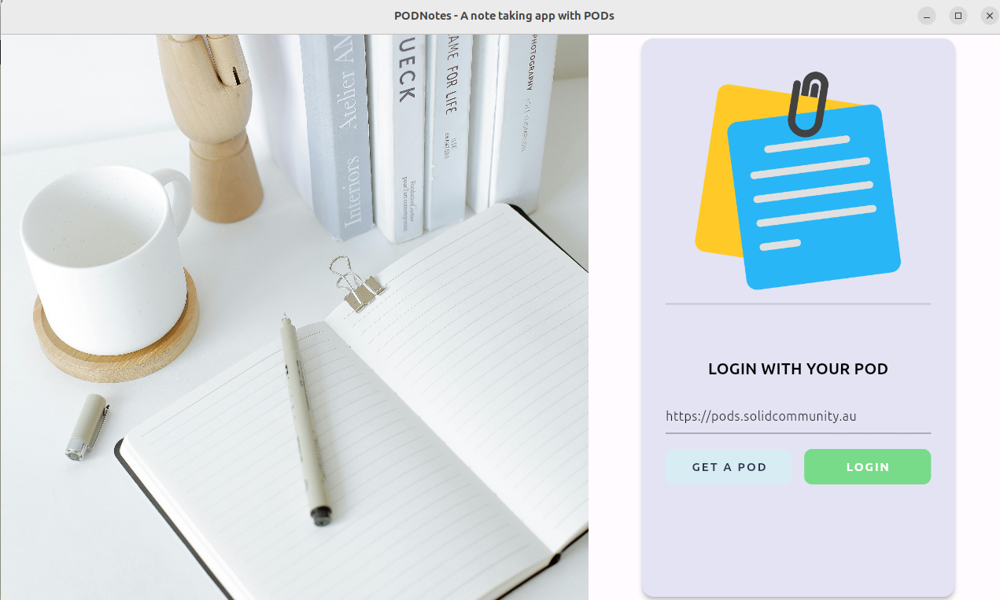

# PodNotes Markdown Note Taking App with Private PODs

**An ANU Software Innovation Institute demo project for Solid PODs**.

*Authors: Anushka Vidanage, Graham Williams*

*[ANU Software Innovation Institute](https://sii.anu.edu.au)*

*License: GNU GPL V3*

## App Startup

On starting up the app you will see the login screen where a user's
WebID is to be entered. It will be remembered for future app
activity.

To obtain a WebID for yourself, visit our experimental
[Australian Solid Community Pod
Server](https://pods.solidcommunity.au/.account/login/password/register/)
or any one of the available [Pod
Providers](https://solidproject.org/users/get-a-pod) world wide.

On clicking the Login button your browser will popup to authenticate you
on the Solid server of choice, not on the device. The device does not
get to know your login details.

<div align="center">
	
</div>


## Install

Follow the Flutter Dev instructions to install flutter for your preferred platform at [Flutter Dev Getting Started](https://docs.flutter.dev/get-started/install)

After setup, run `flutter doctor` to check your setup, and `flutter devices` to see which devices you have configured, with the device name in the 2nd column
```
flutter devices
Found 4 connected devices:
  iPhone 15 Pro Max (mobile)      • 8978937B-AC64-44B8-8B26-CA6142091678 • ios            • com.apple.CoreSimulator.SimRuntime.iOS-17-0 (simulator)
  iPad (10th generation) (mobile) • 6B849753-743F-4F66-8F46-0396CA4BCFBE • ios            • com.apple.CoreSimulator.SimRuntime.iOS-17-0 (simulator)
  macOS (desktop)                 • macos                                • darwin-arm64   • macOS 14.1.2 23B92 darwin-arm64
  Chrome (web)                    • chrome                               • web-javascript • Google Chrome 120.0.6099.62
```

Run the podnotes app in debug mode on your chosen device by specifying enough of the device name to be uniquely identifiable.
```
flutter run -d chrome
```

When you have completed the setup of your platform, you are ready for the [PodNotes Getting Started](exercises/README.md) exercises where you can create a POD, make and share notes.

### Extra setup for MacOS

Running the app on MacOS requires, additional configuration in Xcode. Open the project macos folder in Xcode with
```
cd podnotes/macos
xed .
```
Select `Signing & Capabilities`. In `Team`, choose `Add an Account` and sign in with your Apple ID account. In `Network`, select `Incoming Connections (Server)` and `Outgoing Connections (Client)`. The latter is needed to login to your POD.

### Extra setup for iOS

For iOS, you will also need to set the deployment platform to match the iOS version on your simulator.

Open the Simulator app, select your simulated device with `File` -> `Open Simulator` -> pick a device.
```
open -a Simulator
```
Then in the simulated device check the iOS version number by clicking on the `Settings`app and going to `General` -> `About` to look up the iOS.

Open the project iOS folder in Xcode and add the iOS version used by your simulator.
```
cd podnotes/ios
xed .
```
Select `General`. In `iOS`, change it to match the Simulator iOS version, e.g. `v17.0`.
