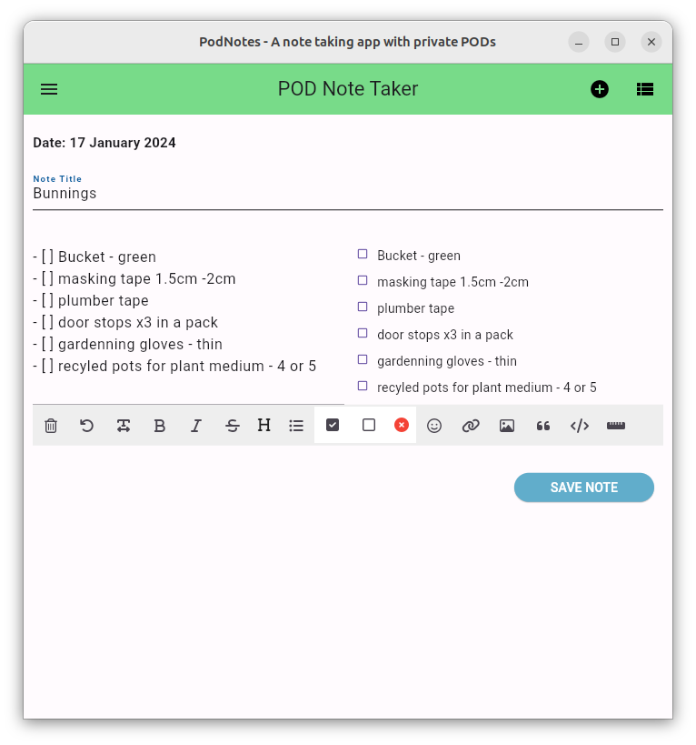

# PodNotes 

## Markdown Notes with Encrypted Pods

**An ANU Software Innovation Institute demo project for Solid Pods**.

*Authors: Anushka Vidanage, Graham Williams, Jessica Moore*

*[ANU Software Innovation Institute](https://sii.anu.edu.au)*

*License: GNU GPL V3*

## Introduction

The podnotes app is an example of a [Solid
Pods](https://solidproject.org/about) app written in
[Flutter](https://flutter.dev/) to read, write, and share encrypted
notes stored on your personal online data store (Pod) hosted on a
[Solid
Server](https://github.com/CommunitySolidServer/CommunitySolidServer). Since
you control where your notes are stored, and they are stored as
standard Markdown, other apps can also interact with your notes. You
maintain full control over **your** data, not the app developer
collecting and hoarding **your** data.

This first beta release (version 0.1.0) is functional and usable. Use
cases include writing quick notes while on the move to come back to
later on, capturing shopping lists that can be shared with your family
and called up the next time anyone of the family is at the shops, and
much more.

The current podnotes code base includes a lot of low level code that
is being migrated to the [solid](https://github.com/anusii/solid)
package for Flutter. Once migrated it will be even easier to build
your first Pods-based Flutter app.

**Shopping List**

<div align="center">
	
</div>

## Obtaining a Pod

To use the app you will need your own Pod hosted on a Solid server. To
try it out you can get yourself a Pod at our experimental server, the
[Australian Solid Community Pod
Server](https://pods.solidcommunity.au/.account/login/password/register/)
or any one of the available [Pod
Providers](https://solidproject.org/users/get-a-pod) world wide.

## Online Demo

Once you have your own Pod visit https://podnotes.solidcommunity.au
and login to your Pod. Write and save a few notes, edit saved notes,
and maybe share some notes with other users. That's it! Simple but
useful.

## Install the App Locally

You can install the app onto your own device using one of our
installers. The app will then run locally on your own device rather
than hosted on a web server. The installers are available for all
platforms from <a
href="https://github.com/anusii/podnotes/tree/main/installers">github</a>. The
installers we make available are ready to run executable files or else
operating system specific installation packages. Stay tuned for links
to repository distribution.

## App Startup

On starting up the app you will see the login screen where a user's
WebID is to be entered. Your login will be remembered through the
browser for future app activity.

On clicking the Login button your browser will popup to authenticate you
on the Solid server of choice, not on the device. The device does not
get to know your login details.

<div align="center">
	
</div>

## Install Flutter and Podnotes<a name="install"></a>

You can run the app directly from its source yourself with a little
setup. You could then also modify the app to suit your own needs, or
to add functionality that you may like to contribute back to the
community. 

Begin with the Flutter Dev instructions to install flutter for your
preferred platform at [Flutter Dev Getting
Started](https://docs.flutter.dev/get-started/install)

After setup, run `flutter doctor` to check your setup, and `flutter
devices` to see which devices you have configured, with the device
name in the 2nd column

```
flutter devices
Found 4 connected devices:
  iPhone 15 Pro Max (mobile)      • 8978937B-AC64-44B8-8B26-CA6142091678 • ios            • com.apple.CoreSimulator.SimRuntime.iOS-17-0 (simulator)
  iPad (10th generation) (mobile) • 6B849753-743F-4F66-8F46-0396CA4BCFBE • ios            • com.apple.CoreSimulator.SimRuntime.iOS-17-0 (simulator)
  macOS (desktop)                 • macos                                • darwin-arm64   • macOS 14.1.2 23B92 darwin-arm64
  Chrome (web)                    • chrome                               • web-javascript • Google Chrome 120.0.6099.62
```

Then git clone the podnotes repository from github.

Run the podnotes app in debug mode on your chosen device by specifying
enough of the device name to be uniquely identifiable. E.g. for chrome
use:

```
flutter run -d chrome
```

When you have completed the setup of your platform, you are ready for
the [PodNotes Getting Started](exercises/README.md) exercises where
you can create a Pod, make and share notes.

### Extra setup for MacOS<a name="extra_for_macos"></a>

Running the app on MacOS requires, additional configuration in
Xcode. Open the project macos folder in Xcode with

```
cd podnotes/macos
xed .
```

Select `Signing & Capabilities`. In `Team`, choose `Add an Account`
and sign in with your Apple ID account. In `Network`, select `Incoming
Connections (Server)` and `Outgoing Connections (Client)`. The latter
is needed to login to your Pod.

### Extra setup for iOS<a name="extra_for_ios"></a>

For iOS, you will also need to set the deployment platform to match
the iOS version on your simulator.

Open the Simulator app, select your simulated device with `File` ->
`Open Simulator` -> pick a device.

```
open -a Simulator
```

Then in the simulated device check the iOS version number by clicking
on the `Settings`app and going to `General` -> `About` to look up the
iOS.

Open the project iOS folder in Xcode and add the iOS version used by
your simulator.

```
cd podnotes/ios
xed .
```

Select `General`. In `iOS`, change it to match the Simulator iOS
version, e.g. `v17.0`.


## Useful resources

Packages:

These dart packages are under construction to support the development
of Pods-based apps with flutter

- [solid](https://github.com/anusii/solid) package (not yet available
  on pub.dev): Implementation of the core high-level functionality.
  
- [solid-auth](https://pub.dev/packages/solid_auth) package:
  Implementation of the Solid-OIDC flow which can be used to
  authenticate a client application to a Solid Pod. Solid OIDC is
  built on top of OpenID Connect 1.0. Also provides a suite of tools
  and widgets to support typical app workflows.

- [solid-encrypt](https://pub.dev/packages/solid_encrypt) package: The
  Software Innovation Institute has a focus on the security of our
  stored data. This package implements data encryption which can be
  used to encrypt, on device, the content of turtle files to be stored
  in a Solid Pod. Data is also only decrypted on device.

- [rdflib](https://pub.dev/packages/rdflib) package: A dart package
  for working with RDF. Features include find and create triple
  instances, create a graph to store triples, export graph to ttl,
  etc.


## Related APps

https://notepod.vincenttunru.com/
