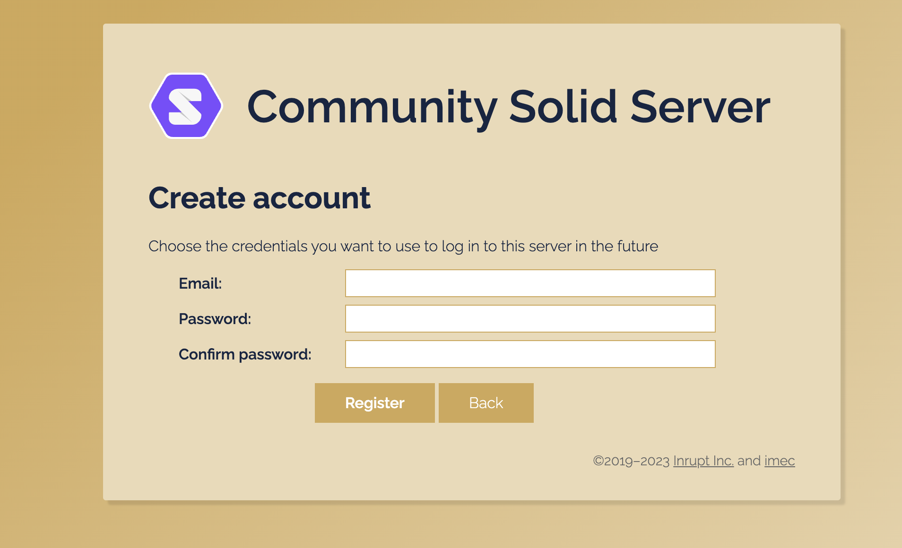
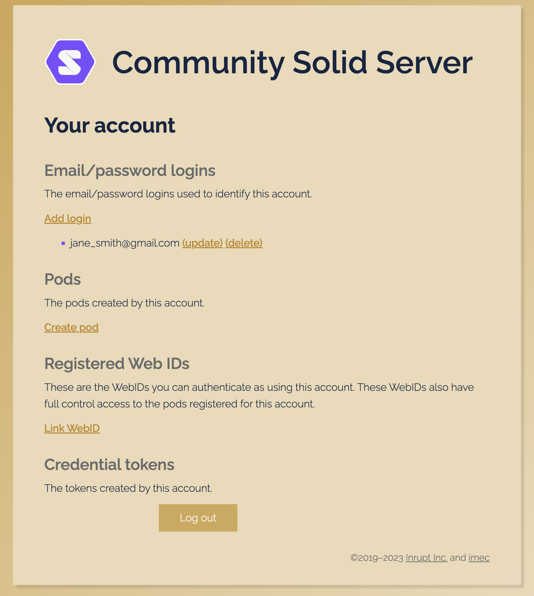
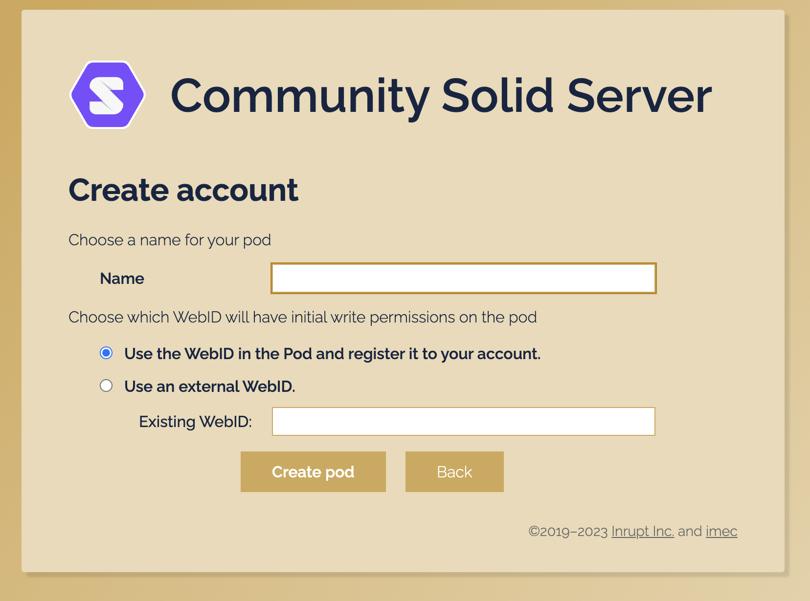
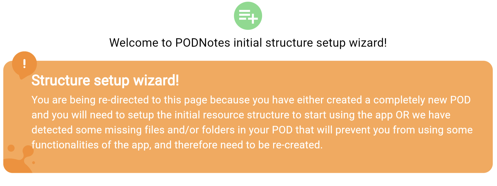

# Exercise 1: Get a POD and Login to Podnotes app

This exercise will show you how to create a POD on the solid server host https://solidcommunity.au/ and how to use the Podnotes app to create and save notes to your POD.

## Setup

Option 1: Open the Podnotes app using the web app or download links for the binary for your OS:

- [Podnotes web app](https://Podnotes.solidcommunity.au/)
<!--- Podnotes Windows app (.exe)
- Podnotes MacOS app (.app)
- Podnotes Linux app
- Podnotes Android app (.apk) -->


Option 2: If you already have `flutter` installed and setup to build to `chrome` or desired platform (Linux, MacOS, Windows, Android, iOS), you may build and run the Podnotes app locally on your machine.

```
flutter devices
flutter run -d [your device]
```


## Get a POD

The Podnotes app requires you to have a POD hosted on any solid server, which is identified on the internet with a webID comprising the unique resource identifier (URI) of your POD. We have setup a solid server for the Solid AU Community for experimenting with Solid. You can use this solid server to get a POD if you don't have one on any Solid server.


Open [Podnotes app](https://Podnotes.solidcommunity.au/) and click `Get a POD`.

This will take you to https://pods.solidcommunity.au, click `Sign up for an account`

Enter an email address, and the password you want to use to access your POD and click `Register`.



This will take you to an POD account view window, click `Create pod`.



In the `Name` field, enter a name for your POD, eg the username of your email address.

If you already have a Solid webID, you can link your webID to your new POD on Solid Community AU, by selecting `Use an external webID`.

Click `Create POD` to start creating a POD on the host https://solidcommunity.au.

If you don't yet have a Solid webID, select `Use the webID in POD and register it to your account`.

Confirm by clicking `Create POD`.



You should see a window, with the URL of your POD and your webID.

Note: to look up your webID at anytime, login to https://pods.solidcommunity.au/


## Login and set  encryption key

The Podnotes app stores your files in encrypted form. To do this you must create a password to use as the master key for encrypting your POD files.
The first time you login in to the Podnotes app, you need to set the master encryption key. Your files are only decrypted in the app. Each time you subsequently login, you will need to provide the master encryption key after app login to see your files.

Open [Podnotes app](https://Podnotes.solidcommunity.au/) and click `Login`.

A Community Solid Server authorization window will pop up with the last credentials which you've used on the Solid Community AU host.

Click `Authorize` to login to your POD in the Podnotes app.

This will take you to the Podnotes Setup Wizard to finish setting up your POD. This shows the resources (files) being created in your POD on the Solid Community AU solid server, and ask you to set an master encryption key which will be used to encrypt the notes on your POD.



Enter your name and gender.

Enter a new password to use as your master encryption key for this POD.

Click the confirm checkbox and click `Submit`.

You are now setup and logged in the Podnotes app.

Repeat login to the Podnotes app will typically remember your pod webID in the Authorize window.
