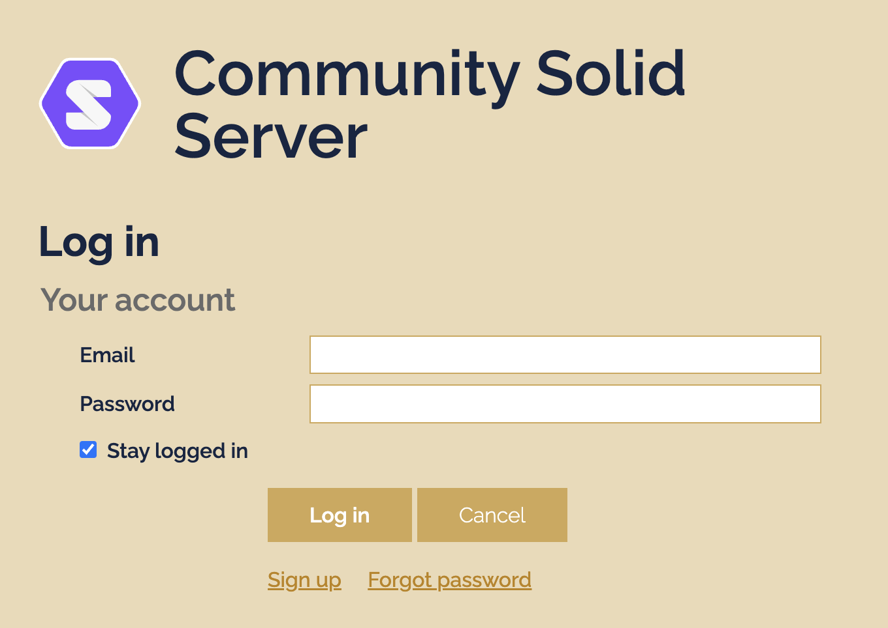
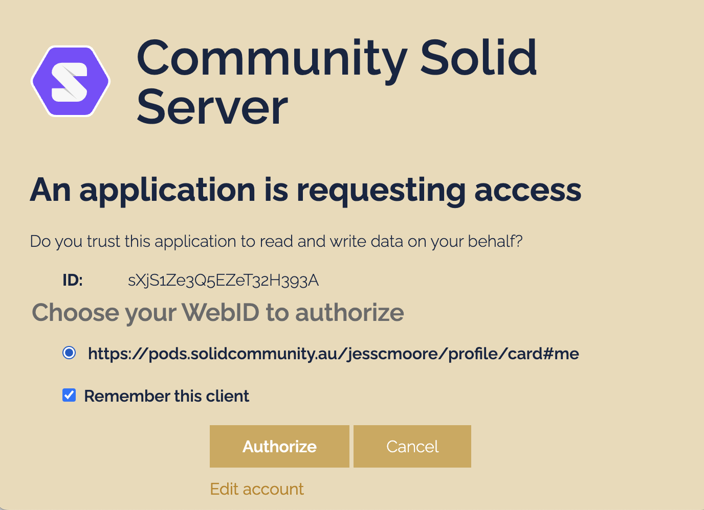
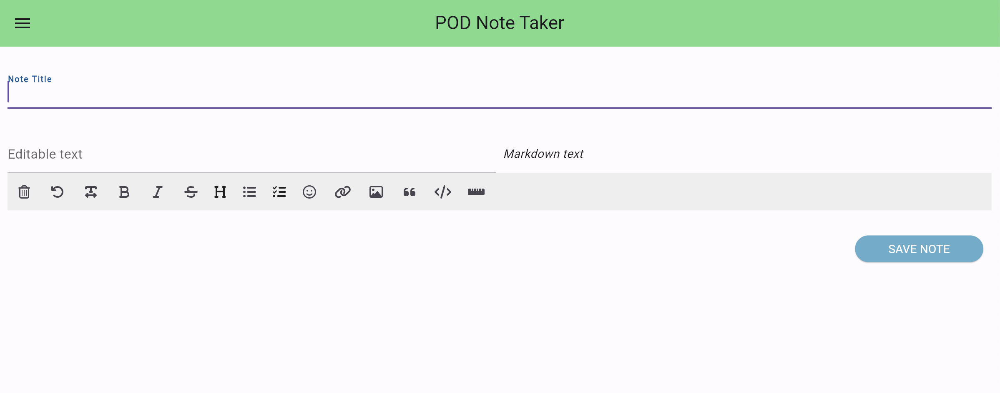
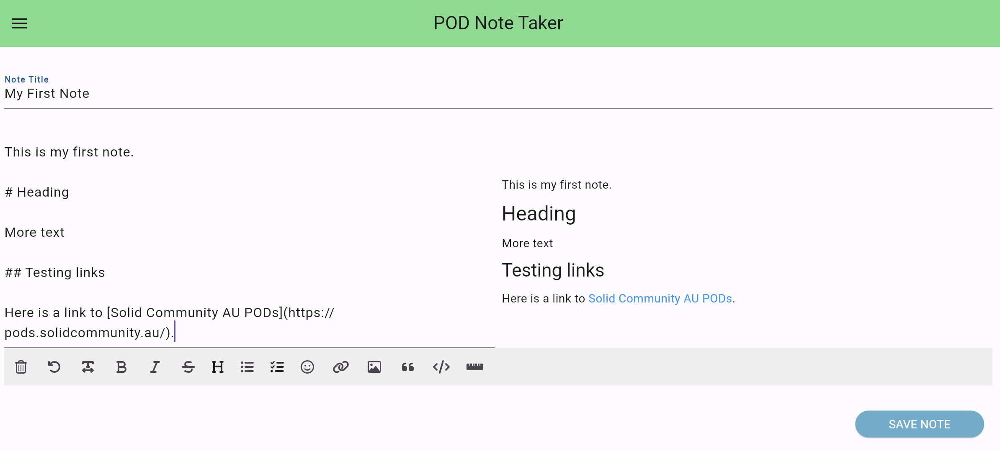
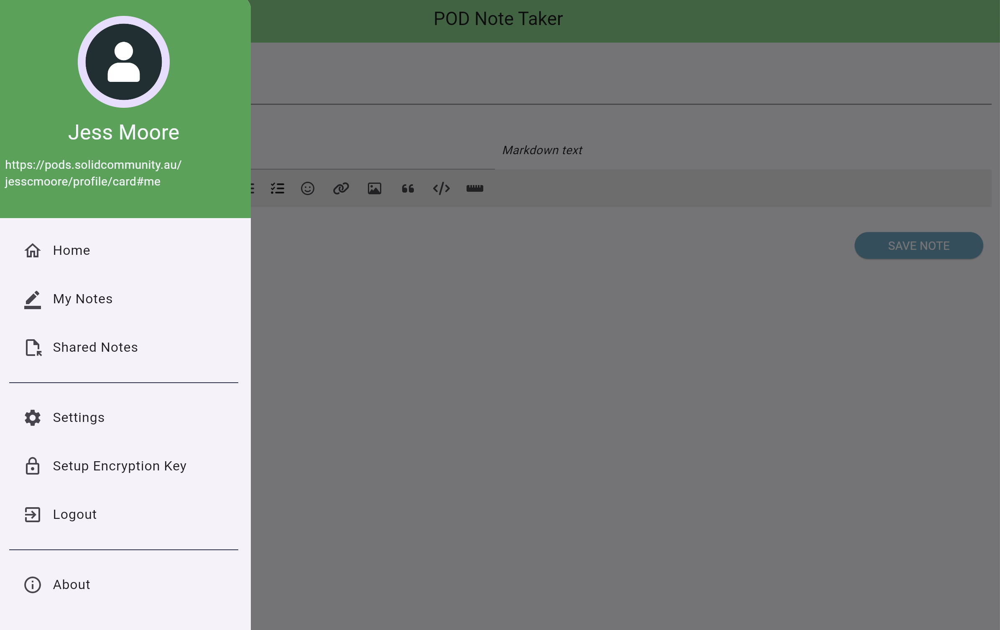
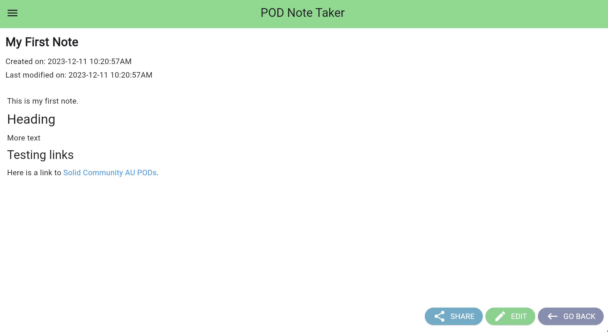

# Exercise 2: My First Note

This exercise will show you how to create a note in the Podnotes app.

## Login

Open the Podnotes app ([web app](https://Podnotes.solidcommunity.au/)) and click `Login`. If you have not logged in recently, you will probably see a login window, enter the email address and password that you used to create your POD.

This will open an popup with your POD webID. Click `Authorize` to login to your POD in the Podnotes app.

(Note: If you have flutter installed, you could also build and run the app locally on your machine.)

## Make a Note

By default, the Podnotes app opens on the create new note page, or you can get to this page by selecting `Home` in the menu.

In `Note Title`` field, enter a title for your note.

Below the Note Title field, enter the text of your note using markdown.

As you write you will see the rendered html is shown on the right hand side.

Click `Save` button to save your note. (Note: the app is not auto saving in the background, although that can be implemented in flutter).

After saving, you wil see an empty new note page.

Open the menu and click `My Notes` to view your saved notes.

Congratulations, you have successfully saved your first note in a POD!

You can open your note, by clicking on your note in the list.

