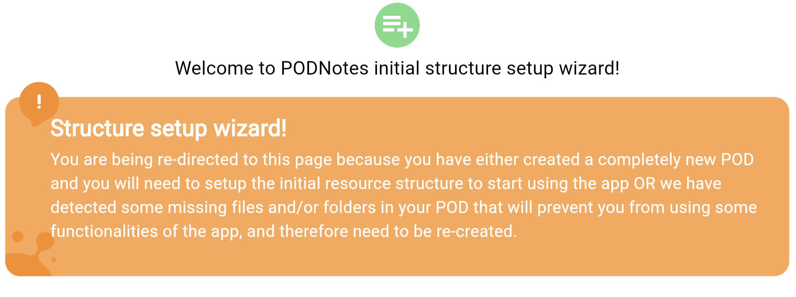

# Exercise 2: My First Note

This exercise will show you how to create a note in the Podnotes app.

## Login

Open the Podnotes app ([web app](https://Podnotes.solidcommunity.au/)) and login with your webID.

(If you have flutter installed, you could also build and run the app locally on your machine.)

## Make a Note

