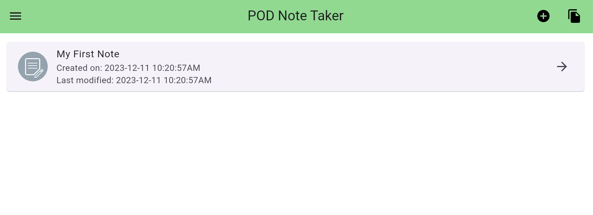
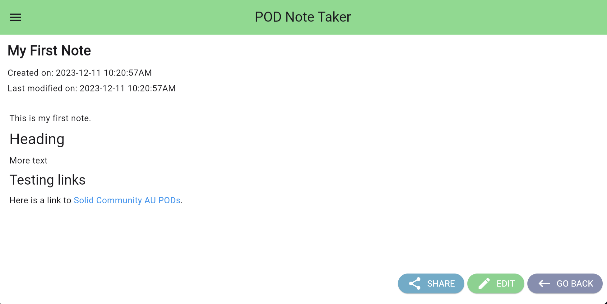
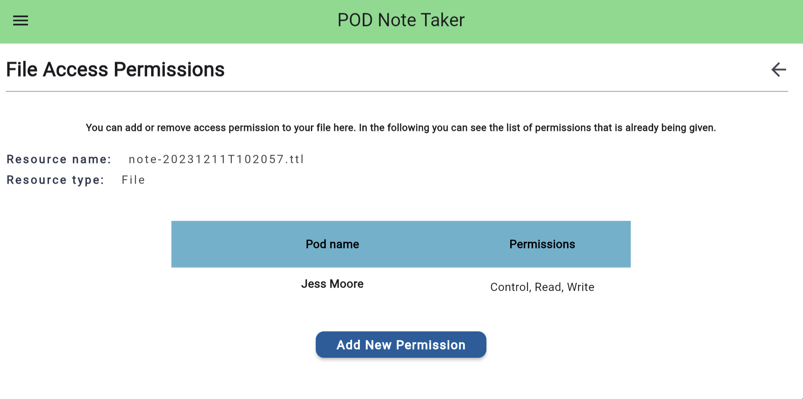
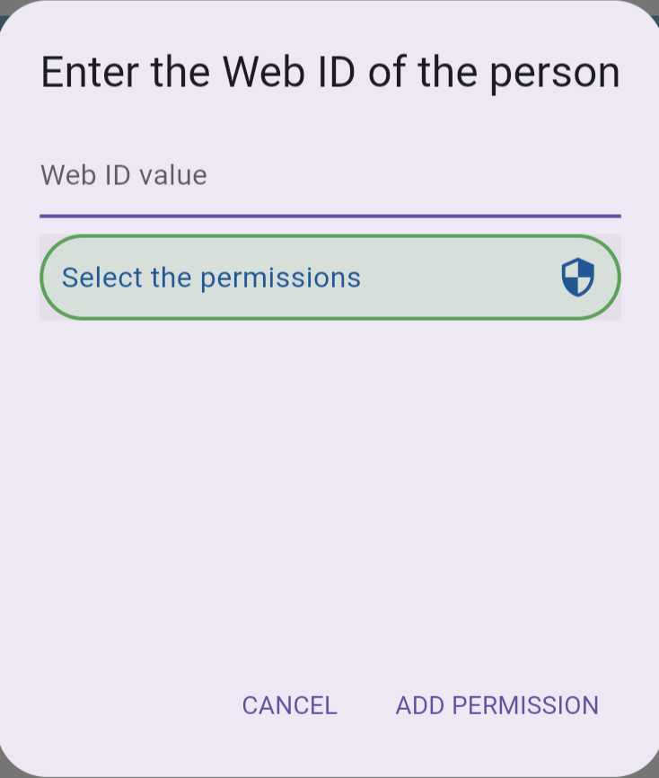
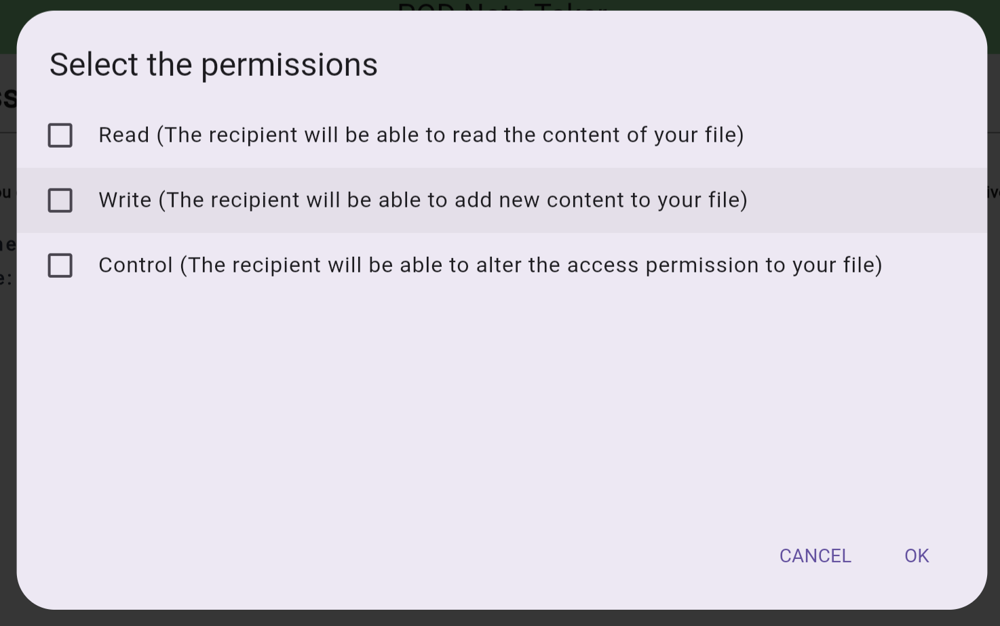
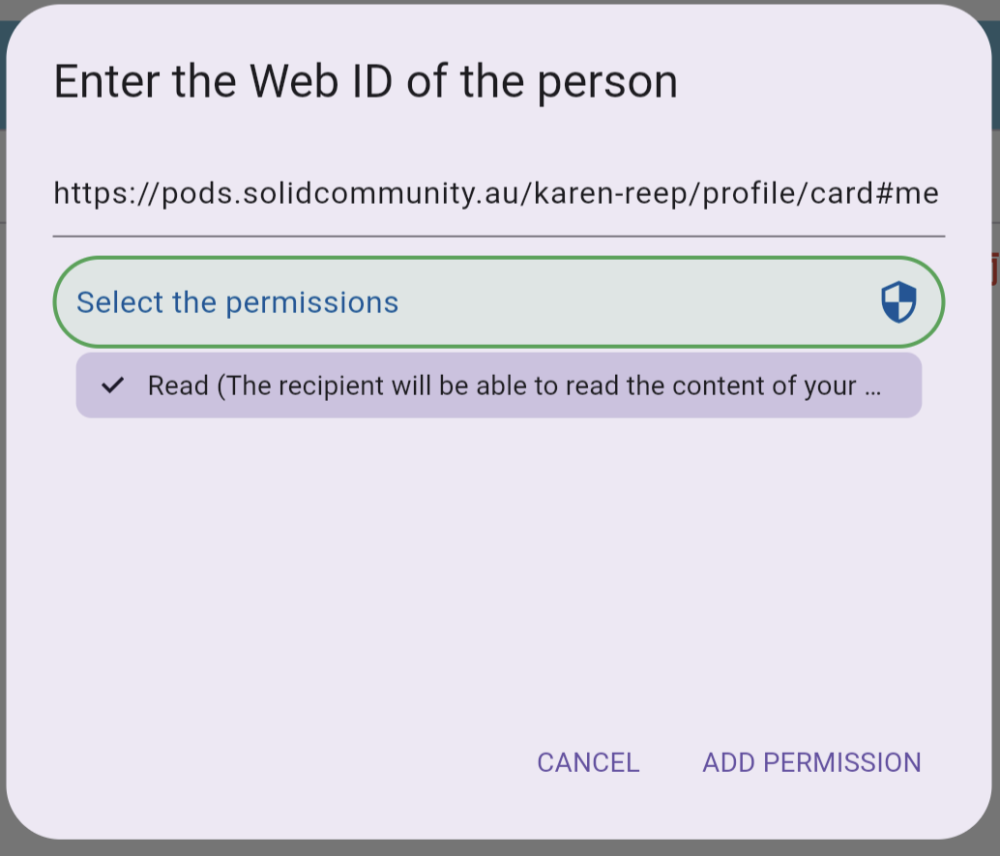
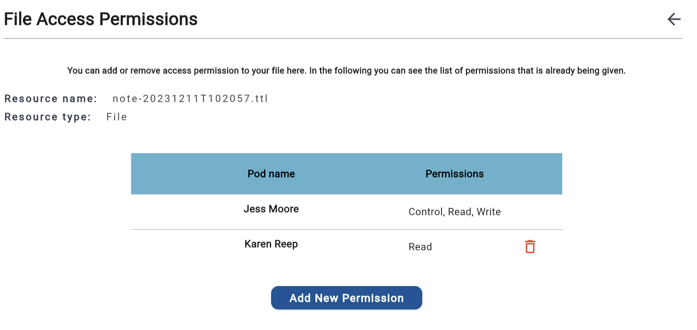
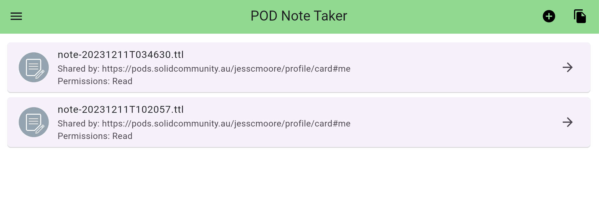
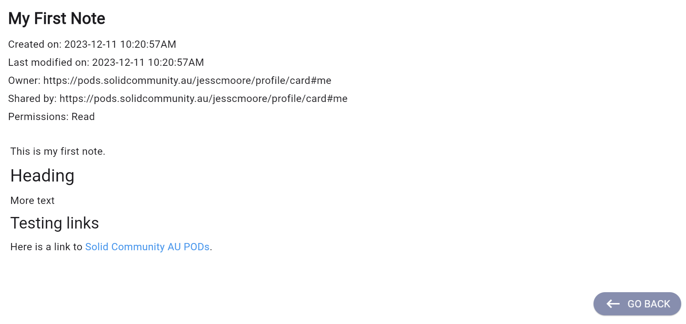

# Exercise 3: Share a Note

This exercise will show you how to share a note in the Podnotes app.

Is Solid, sharing a note to another person is the act of editing the access control list of a resource which you control to make that resource accessible to the other person's webID. It does not mean they have accessed the resource, only that they could have done so, if they attempted to read the URI of the shared resource.

The access permissions of a note file describe which other people (as described by their webID) have access to your note file. Each note file is a turtle (.ttl) file, describing the contents using Resource Description Framework triples.

## View the Sharing of a Note


In the menu, select `My Notes` to open the list of your notes, and click on the note you wish to share.



From within the note, click the sharing icon.



This will show the list of access permissions for the note file. The table below shows all the pods that have access to the note, including your pod, and the access level that recipient PODs have been granted.

Definitions (including permission levels):

- `Resource name` is the filename of the note.
- `Pod name` - is the name of the person that was provided by the person who registered the pod.
- `Read` - Users or apps signed in with this POD webID may **read** this resource file.
- `Write` - Users or apps signed in with this POD webID may **edit** this resource file.
- `Control` - Users or apps signed in with this POD webID may **share** this resource file to other PODs.

A newly created note which you have not yet shared will have the file access permissions similar to below with yourself as POD owner with `read`, `write ` and `control` access.




## Share the Note

First we will test granting read access to a note.

### Testing read access

From the sharing view of a note file, click `Add New Permission`.

You specify the person you are granting access to using their webID.

Ask the person you are granting access to what their webID is. A POD created on the Solid Community AU solid server https://pods.solidcommunity.au will have a webID of the form:

```
https://pods.solidcommunity.au/[pod_name]/profile/card#me
```
where `pod_name` is the name of their pod, and `profile/card#me` is the public card which everyone has in their POD. This is the public profile of that POD owner. You can view a POD user's profile by opening the webID URI in a web browser.


Enter their `webID` in the `web ID value` text field.

Press the `Select the Permissions` button to select permisisons.



Click the checkbox to give the recipient `Read` access, and submit by pressing `OK`.



Click `Add permission` to **confirm** that you are granting the recipient this access to your note file.



You have now granted the recipient access to your note file!




**The next actions are done by the recipient of your note**

Now ask the recipient to login to their Podnotes app, and select `Share Notes` from the menu.

They should see your note in their shared notes list.



They can read the note, however they do not have edit permission, hence they do not see an edit button from the note view.




## Test granting rw access

**These actions are by you**

From the sharing view of a note file, click `Add New Permission`.

This time grant the recipient, `Read` and `Write` access.

Submit by pressing `OK` and click `Add permission` to **confirm** that you are granting the recipient this access to your note file.

**The next actions are done by the recipient of your note**

Now ask the recipient to login to their Podnotes app, and select `Share Notes` from the menu.

From their shared notes list, ask them to open the note.

They can read and write to the note, however they do not have edit permission, hence they do not see an edit button from the note view.


