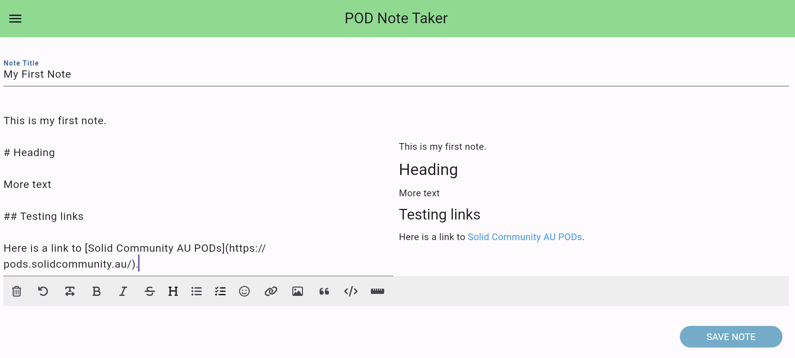
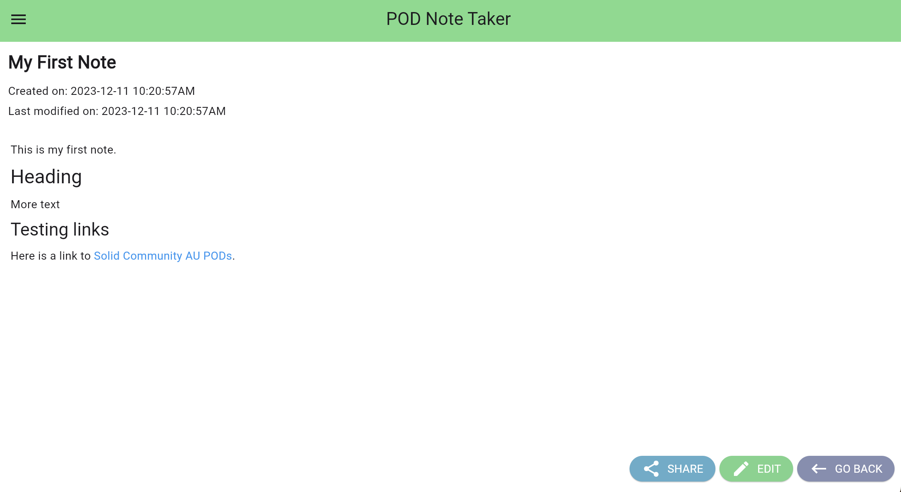

# Exercise 3: Share a Note

This exercise will show you how to share a note in the Podnotes app.

Is Solid, sharing a note to another person is the act of editing the access control list of a resource which you control to make that resource accessible to the other person's webID. It does not mean they have accessed the resource, only that they could have done so, if they attempted to read the URI of the shared resource.

The access permissions of a note file describe which other people (as described by their webID) have access to your note file. Each note file is a turtle (.ttl) file, describing the contents using Resource Description Framework triples.

## View the Sharing of a Note

In the menu, select `My Notes` to open the list of your notes, and click on the note you wish to share.

This will show the list of access permissions for the note file. `Resource name` is the filename of the note. The table below shows all the pods that have access to the note, including your pod, and what access level they have. The `Pod name` is the name of the person that was provided by the person who registered the pod. The access permission levels are:

- **Read** - Users or apps signed in with this POD webID may **read** this resource file.
- **Write** - Users or apps signed in with this POD webID may **edit** this resource file.
- **Control** - Users or apps signed in with this POD webID may **share** this resource file to other PODs.

## Share the Note

From the sharing window of a note file, click `Add New Permission`.

As you write you will see the rendered html is shown on the right hand side.

Click `Save` button to save your note. (Note: the app is not auto saving in the background, although that can be implemented in flutter).

After saving, you wil see an empty new note page.

Open the menu and click `My Notes` to view your saved notes.

Congratulations, you have successfully saved your first note in a POD!

You can open your note, by clicking on your note in the list.

