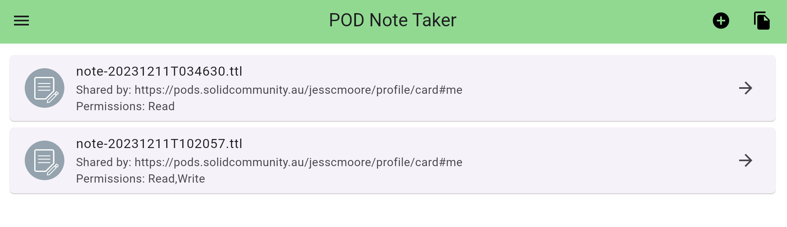
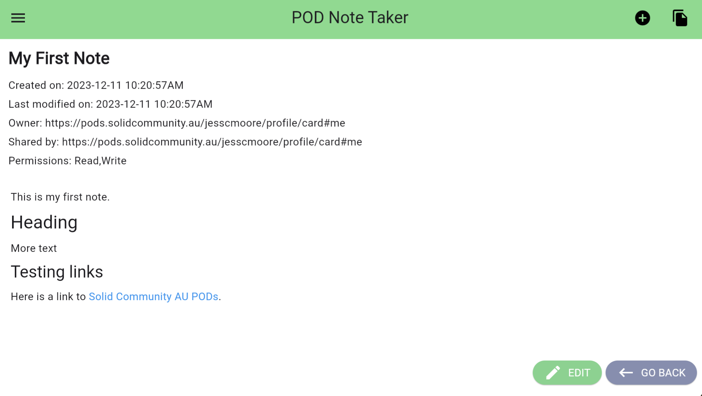
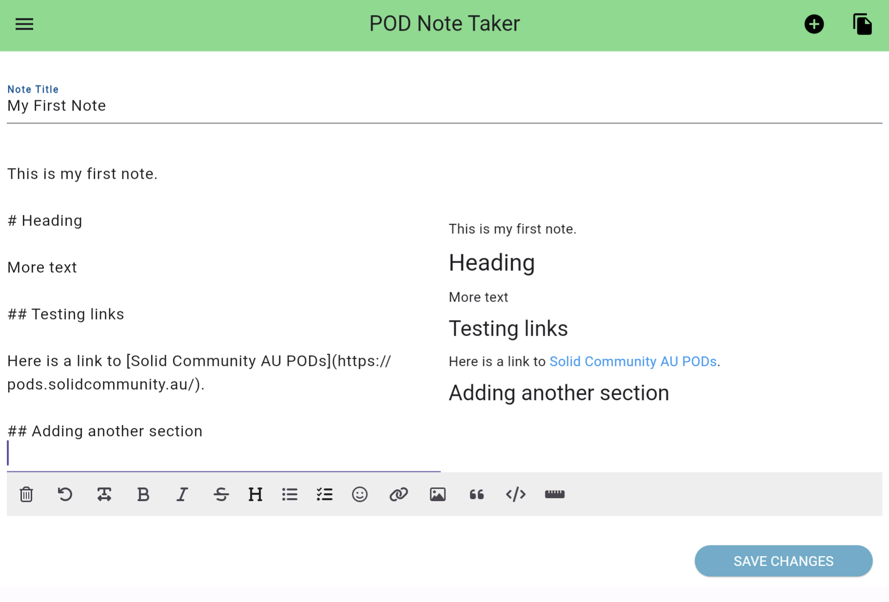
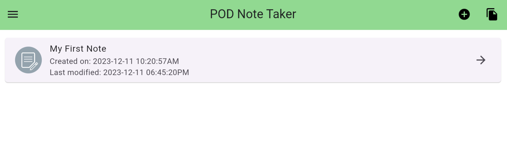
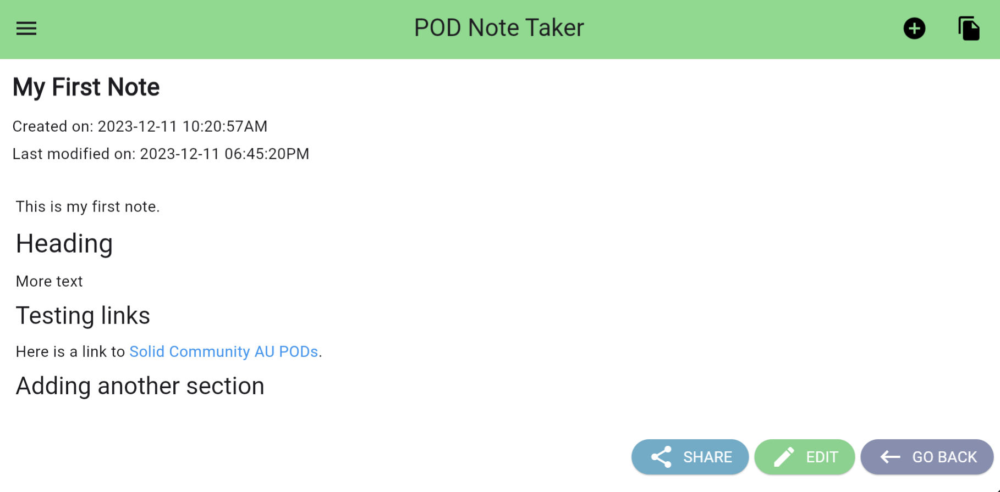

# Exercise 3: Share a Note

**Table of Contents**

- [View Sharing Permissions of a Note](#permissions)
- [Share a Note](#share)
  + [Grant read access](#share_r)
  + [Grant read and write access](#share_rw)

This exercise will show you how to share a note in the Podnotes app.

Is Solid, sharing a note to another person is the act of editing the access control list of a resource which you control to make that resource accessible to the other person's webID. It does not show whether they have accessed the resource, it only makes the resource accessible to the recipient via the resource URI.

The access permissions of a note file describe which other people (identified by their webID) have access to your note file.


## View Sharing Permissions of a Note<a name="permissions"></a>


In the menu, select `My Notes` to open the list of your notes, and click on the note you wish to share.


From within the note, click the sharing icon.


This will show the list of access permissions for the note file. The table below shows all the pods that have access to the note, including your pod, and the access level that recipient PODs have been granted.

Definitions (including permission levels):

- `Resource name` is the filename of the note.
- `Pod name` - is the name of the person that was provided by the person who registered the pod.
- `Read` - Users or apps signed in with this POD webID may **read** this resource file.
- `Write` - Users or apps signed in with this POD webID may **edit** this resource file.
- `Control` - Users or apps signed in with this POD webID may **share** this resource file to other PODs.

A newly created note which you have not yet shared will have the file access permissions similar to below with yourself as POD owner with `read`, `write ` and `control` access.


## Share a Note<a name="share"></a>

First we will test granting read access to a note.

### Grant read access<a name="share_r"></a>

From the sharing view of a note file, click `Add New Permission`.

You specify the person you are granting access to using their webID.

Ask the person you are granting access to what their webID is. A POD created on the Solid Community AU solid server https://pods.solidcommunity.au will have a webID of the form:

```
https://pods.solidcommunity.au/[pod_name]/profile/card#me
```
where `pod_name` is the name of their pod, and `profile/card#me` is the public card which everyone has in their POD. This is the public profile of that POD owner. You can view a POD user's profile by opening the webID URI in a web browser.


Enter their `webID` in the `web ID value` text field.

Press the `Select the Permissions` button to select permisisons.


Click the checkbox to give the recipient `Read` access, and submit by pressing `OK`.


Click `Add permission` to **confirm** that you are granting the recipient this access to your note file.


You have now granted the recipient access to your note file!


**The next actions are done by the recipient of your note**

Now ask the recipient to login to their Podnotes app, and select `Share Notes` from the menu.

They should see your note in their shared notes list.


They have been granted `Read` permission, hence they can open and read the note

However they do not have write permission, hence they do not see an `Edit` button in the note view.

Similarly, they have not been granted control permission and consequently do not see an `Share` button in the note view.


## Grant read and write access<a name="share_rw"></a>

**These actions are by you**

From the sharing view of a note file, click `Add New Permission`.

This time grant the recipient, `Read` and `Write` access.

Submit by pressing `OK` and click `Add permission` to **confirm** that you are granting the recipient this access to your note file.


**The next actions are done by the recipient of your note**

Now ask the recipient to login to their Podnotes app, and select the `Share Notes` list from the menu.

From their shared notes list, ask them to open the note.



They have beenn granted `Read` and `Write` permission. This means they can read and write to the note, hence they have an `Edit` button in the note view.

They do not have the `Share` button, as you did not grant them `Control` permission.



Ask them to click `Edit` and add some text to your note - here they have added the section `Another Section`. In this way the recipient is able to collaborate with you on the note, while you keep sharing control.




**These actions are by you**

Now, open your My Notes list, you will see the last modification time has been updated. Click the note to open it.



Here you can see the additional text added by the recipient.


